# Awesome-Mixed-Reality-Headset-Hardware

  

  
  
  
  
  

---

## 🚀 Overview & Comprehensive Directory

Welcome to the definitive, SEO-optimized awesome list for **Mixed Reality Headset Hardware**, **Spatial Computing Platforms**, **Enterprise AR/VR Solutions**, and **Open-Source XR Software Frameworks**. 

Whether you are an enterprise spatial computing architect, AR/VR game developer, human-computer interaction (HCI) researcher, or open-source hardware tinkerer, this curated directory highlights the leading commercial headsets (Apple Vision Pro, Meta Quest Pro, Varjo XR-4, HoloLens 2, HTC Vive XR Elite), enterprise SaaS platforms (PTC Vuforia, Matterport, Scope AR), and open-source spatial projects (Godot Engine, OpenXR, OpenGalea BCI, Monado, ALVR, Envision).

**Last updated: October 2026** 📅

---

## 📖 Table of Contents

- [🥽 Commercial Headset Hardware](#-commercial-headset-hardware)
- [☁️ Enterprise AR & Spatial Computing SaaS Platforms](#️-enterprise-ar--spatial-computing-saas-platforms)
- [🔓 Open-Source XR Software & Hardware Projects](#-open-source-xr-software--hardware-projects)
- [🤝 How to Contribute](#-how-to-contribute)
- [☕ Support & Sponsorship](#-support--sponsorship)
- [⚠️ Disclaimer](#-disclaimer)
- [⭐ Star History](#-star-history)

---

## 🥽 Commercial Headset Hardware

> **📊 Market Context**: The global mixed reality headset market is estimated at **~$8B in 2026**, growing toward **~$25B by 2032**. The sector is **moderately fragmented** — **Meta Quest** dominates consumer VR, **Apple Vision Pro** leads the premium spatial computing tier, and **Varjo** serves the high-end enterprise training segment. **Critical lifecycle notice**: **Microsoft HoloLens 2 production ended in October 2024** — enterprise AR is contracting, not expanding. **Magic Leap pivoted away from hardware** toward enterprise software. **Pricing varies dramatically**: Meta Quest Pro is **$869–$1,500**, Apple Vision Pro starts at **$3,499** ($3,699 after recent component cost increases), HoloLens 2 was **$3,500**, Magic Leap 2 is **₹418,900** in India (~$5,000 USD), Varjo XR-4 Secure Edition is **$32,468–$38,268**, and Sony SRH-S1 is **$4,750**. No single vendor holds a winner-take-all position. 🏷️

| Hardware | Description | Pricing (Starting Tier) 💵 | Linux/Open-Source Support 🐧 | Company Size / Revenue 🏢 |
|----------|-------------|------------------------|--------------------------|--------------------------|
| **[Apple Vision Pro](https://www.apple.com/apple-vision-pro/)** | **Premium spatial computing headset.** Micro-OLED 4K per-eye displays, high-fidelity real-time passthrough, Mac integration, visionOS ecosystem. 🍎 | **$3,499** (US); **$3,699** (post cost increase) | **No official support.** visionOS is proprietary & closed. | **~$400B revenue** (Apple Inc. parent) |
| **[Microsoft HoloLens 2](https://www.microsoft.com/en-us/hololens)** | **Enterprise AR optical headset.** Transparent holographic wave-guides, hand/eye tracking, Azure spatial anchors. **Production ended October 2024**. 🪟 | **$3,500** (US) / **₹495,000** (India) | **No official support.** Windows Holographic platform. | **~$281B revenue** (Microsoft Corp. parent) |
| **[Meta Quest Pro](https://www.meta.com/quest/quest-pro/)** | **Consumer/prosumer MR headset.** Pancake optics, face & eye tracking, color passthrough, Quest OS. ♾️ | **$869–$1,500** (US) | **Android-based.** **SideQuest** enables sideloading; **OpenGalea** BCI integration. | **Part of Meta (~$165B revenue)** |
| **[Lenovo ThinkReality VRX](https://www.lenovo.com/)** | **Enterprise VR/MR headset.** Snapdragon XR2+ Gen 1, color passthrough, ThinkReality enterprise software platform. 💻 | **¥243,251–¥249,781** (Japan/Newegg) | **Android-based.** Enterprise SDK provided. | **~$60B revenue** (Lenovo FY2025 est.) |
| **[Sony SRH-S1](https://www.sony.com/)** | **Spatial content creation headset.** 4K per-eye OLED microdisplays, Snapdragon XR2+ Gen 2, stylus ring controllers, Siemens industrial design integration. 🎮 | **$4,750** (US) | **No official support.** Proprietary Sony spatial platform. | **~$30B gaming revenue** (Sony Group parent) |
| **[Varjo XR-4](https://varjo.com/)** | **High-end enterprise XR headset.** Human-eye resolution passthrough, focal tracking, Secure Edition for defense simulation. 🛡️ | **$32,468–$38,268** (Secure Edition) | **No official support.** Proprietary Varjo OS & drivers. | **Private (~$100M+ raised)** |
| **[Magic Leap 2](https://www.magicleap.com/)** | **Enterprise AR headset.** Lightest AR headset at **260g**, dynamic optical dimming, 70° FOV. **Pivoted to software**. 🪄 | **₹418,900** (India) / **$30,244 SGD** | **No official support.** Magic Leap OS proprietary. | **Private (Magic Leap Inc.)** |
| **[Pico 4 Enterprise](https://www.picoxr.com/)** | **Enterprise VR headset.** 4K+ resolution display, face/eye tracking, enterprise MDM management tools. 📦 | **$943.95** (Knoxlabs) | **Android-based.** Enterprise SDK provided. | **Part of ByteDance** |
| **[HTC Vive XR Elite](https://www.vive.com/us/product/vive-xr-elite/)** | **All-in-one VR/AR headset.** Modular design, 12 GB RAM, convertible glasses form factor. 👓 | **₹81,780–₹89,999** (India) | **Android-based.** Developer tools available. | **Private (HTC Corp)** |
| **[Lynx R1](https://lynx-r.com/)** | **Open mixed reality headset.** Modular prism design, SteamVR compatible, OpenXR support. 🦊 | **$849** (Standard) / **$1,299** (Pro) | **SteamVR compatible** via streaming, **SideQuest** store, UnityXR plugin. | **Private (Lynx MR)** |

---

## ☁️ Enterprise AR & Spatial Computing SaaS Platforms

> **📊 Market Context**: The global spatial computing & enterprise AR SaaS market is estimated at **~$4.5B in 2026**, growing toward **~$18B by 2032**. The sector is **moderately fragmented** — **PTC (Vuforia)** dominates enterprise industrial AR, **Matterport (CoStar Group)** leads spatial digital twin software, while specialized platforms like **Arkio** and **Scope AR** target AEC design and industrial remote assistance. No single SaaS vendor holds a winner-take-all monopoly. 🌐

| SaaS Platform | Description | Pricing (Starting Paid Tier) 💳 | Free Tier Limits 🎁 | Company Size / Valuation 📈 |
|---------------|-------------|------------------------------|------------------|--------------------------|
| **[PTC Vuforia](https://www.ptc.com/en/products/vuforia)** | **Industrial AR & Spatial SaaS.** Enterprise spatial guidance, digital work instructions, model tracking SDK. ⚙️ | **$99/month** (Engine Premium starting tier) | **Basic Plan free forever** (Limited to 1,000 cloud target recognitions/month, core SDK features) | **~$2.74B revenue** (PTC Inc. parent, ~$21B market cap) |
| **[Matterport](https://matterport.com/)** | **Spatial Data & Digital Twin SaaS.** 3D spatial capture, digital twin cloud hosting, floor plan generation. 🏠 | **$10/month** (Starter Plan) | **Free Plan forever** (Limited to 1 active space and 2 user seats; spaces are private) | **~$170M revenue** (Acquired by CoStar Group for $1.6B; parent revenue ~$3.2B) |
| **[Scope AR WorkLink](https://www.scopear.com/)** | **Enterprise AR Work Instructions SaaS.** AR remote support, 3D workflow authoring, real-time spatial procedure guidance. 🛠️ | **$250/user/month** (Starting enterprise seat tier) | **14-day free trial** (Full author/viewer workspace access for pilot testing) | **~$10M ARR** (Private; ~$35M estimated valuation) |
| **[Spatial.io](https://spatial.io/)** | **Enterprise 3D Workspace & Training SaaS.** Immersive enterprise collaboration, 3D corporate training spaces, multi-user XR environments. 🏢 | **$500/month** (Enterprise starter workspace tier) | **14-day enterprise trial** (Full platform demo access; consumer free tier sunset July 2026) | **~$6.9M ARR** (Private; ~$66.8M venture funding raised) |
| **[Arkio](https://www.arkio.is/)** | **Spatial Design & AEC Collaboration SaaS.** Collaborative spatial modeling, Revit/Rhino BIM integration, cross-platform XR design. 📐 | **$35/user/month** (Pro Plan billed annually) | **Starter Plan free forever** (Limited to 1:1 meetings with max 2 participants, basic OBJ/GLB import) | **~$1.2M ARR** (Private venture-backed entity) |

---

## 🔓 Open-Source XR Software & Hardware Projects

The open-source mixed reality ecosystem is expanding rapidly across open game engines, open-source wireless streaming, spatial runtime layers, open hardware BCIs, and Linux VR display managers. Below are key open-source repositories sorted by GitHub_Stars: ✨

| Project / Repo 📁 | Description 📝 | GitHub_Stars 🌟 | License 📜 |
|-------------------|-------------|----------|------------|
| **[Godot Engine](https://github.com/godotengine/godot)** | **Open-source multi-platform 2D/3D game engine with built-in XR support.** Official Microsoft GDK & OpenXR integration enables cross-platform XR development. 🎮 |  | **MIT** |
| **[ALVR](https://github.com/alvr-org/ALVR)** | **Open-source remote VR display streamer.** Stream VR games from PC to standalone headsets (Meta Quest, Pico, Apple Vision Pro) via Wi-Fi with low latency. 📡 |  | **MIT** |
| **[SideQuest](https://github.com/SideQuestVR/SideQuest)** | **Open-source tool & indie app store for sideloading VR content.** Simplifies installing custom builds and experimental apps on Android/Meta Quest VR hardware. 📲 |  | **MIT** |
| **[Godot XR Tools](https://github.com/godotengine/godot-xr-tools)** | **XR utilities and interaction toolkit for Godot Engine.** Provides locomotion, UI interaction, hand tracking, and physics for VR/MR development. 🛠️ |  | **MIT** |
| **[OpenXR SDK](https://github.com/KhronosGroup/OpenXR-SDK)** | **Khronos open standard SDK for XR.** Cross-platform vendor-neutral API for building AR/VR applications targeting diverse spatial computing hardware. 🌐 |  | **Apache-2.0** |
| **[OpenXR-SDK-Source](https://github.com/KhronosGroup/OpenXR-SDK-Source)** | **Source repository for the Khronos OpenXR loader, validation layers, and code generators.** Essential foundation for low-level spatial runtime developers. 🏗️ |  | **Apache-2.0** |
| **[Envision](https://github.com/NickvisionApps/Envision)** | **Open-source UI app to run spatial computing & Monado XR software on Linux.** Enables easy management of OpenXR runtimes and VR streaming tools. 🐧 |  | **GPL-3.0** |
| **[OpenGalea](https://github.com/Caerii/OpenGalea)** | **Open-source mixed reality brain-computer interface (BCI).** Combines OpenBCI Cyton EEG board with Meta Quest 3 for brain-controlled MR experiences (~$1,900 vs ~$30,000 commercial). Includes 3D printable STL files and ML classification code. 🧠 |  | **MIT** |
| **[Monado](https://gitlab.freedesktop.org/monado/monado)** | **Open-source XR runtime for Linux.** Khronos-conformant OpenXR implementation providing tracking, compositor, and device drivers for Linux XR setups. 🐧 | *(GitLab Project)* | **BSL-1.0** |

---

## 🤝 How to Contribute

Contributions are warmly welcomed! Help keep this spatial computing and mixed reality hardware directory accurate and up to date: 💡

1. **Fork** this repository.
2. **Add/Edit** entries in `README.md` following the table formats.
3. Ensure entries include: hardware/software name, verified documentation URL, 1-2 sentence description, updated pricing tier or Stars_Count, and license type.
4. **Submit a Pull Request (PR)** with a clear title describing your addition.

---

## ☕ Support & Sponsorship

If you find this curated directory useful for your spatial computing research, enterprise AR procurement, or open-source development, please consider showing your support: ❤️

- ⭐ **Star this repository** to help others discover it!
- 🔀 **Fork & Share** with your colleagues, XR development teams, and spatial computing communities.
- 💖 **Sponsor the Maintainer**: Support ongoing open-source hardware & software research via the [GitHub Sponsor Dashboard](https://github.com/sponsors/ishandutta2007).

---

## ⚠️ Disclaimer

- This is a **community-curated list** — provided for educational and research purposes only, not an endorsement of any commercial product.
- **Hardware Modification**: Modifying commercial mixed reality headsets or flashing open-source custom firmware may void manufacturer warranties or breach terms of service.
- **Enterprise Lifecycle Context**: Market landscape changes quickly. **Microsoft HoloLens 2 production ended in October 2024**, and **Magic Leap pivoted away from hardware** to software. Enterprise AR remains a dynamic, evolving ecosystem.

---

## ⭐ Star History

---

  <b>Curated with ❤️ for XR developers, spatial computing researchers, and open-source hardware enthusiasts.</b>

